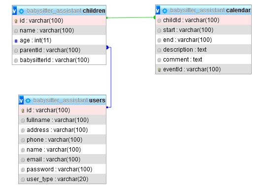

# Babysitter Assistant

## Документация за програмиста

### Описание на проекта.
Babysitter Assistant е уеб базирана среда, която да позволява обмен на информация между родители и човек отглеждащ децата им - детегледач(ка).

### Използвани технологии и библиотеки

Използвани езици
- `PHP`
- `JavaScript`
- `MySQL`
- `CSS3`
- `HTML`

Използвани библиотеки
- `Fullcalendar`
- `Jquery`

### Стартиране на проекта

Проекта може да се стартира чрез добавянето му в  локална среда за разработване, като [XAMPP](https://www.apachefriends.org/index.html). Необходимо е стартирането на `Apache` и `MySQL` модулите, импортването на базата данни `babysitter_assistant.sql` и след това достъпването на проекта в `localhost`


### Структура на проекта

```bash
.
├── assets
│   ├── doc
│   │   └── . . .
│   └── icons
│       └── . . .
├── css
│   ├── calendar.css
│   └── style.css
├── docs
│   ├── developer_documentation.md
│   ├── system_documentation.md
│   └── user_documentation.md
├── fullcalendar
│   └── . . .
├── js
│   └── script.js
└── php
    ├── babysitter
    │   ├── babysitter_header.php
    │   ├── babysitter.php
    │   ├── calendar_event.php
    │   ├── calendar_log_activity.php
    │   ├── calendar.php
    │   ├── children.php
    │   ├── events.php
    │   ├── parents-children.php
    │   ├── parents.php
    │   └── profile.php
    ├── common
    │   ├── calendar.php
    │   ├── config.php
    │   ├── login.php
    │   ├── logout.php
    │   └── register.php
    └── parent
        ├── babysitters.php
        ├── calendar_children.php
        ├── calendar_event.php
        ├── calendar.php
        ├── children_add.php
        ├── children.php
        ├── events.php
        ├── parent_header.php
        ├── parent.php
        └── profile.php
```
Проекта е разделен на директории които следват смислови разграничения. Основният код при разработването на приложението е `PHP` и той се намира в директорията `php/`. Там са обособени 3 директории:
- `common/` - Файлове които са специфични както за логиката на роля **родител** така и за роля **детегледач**. Тук наример може да се намери конфигурацията за базата данни, **login** и **register** формите и кода за създаване на календар
- `parent` - Файлове които изграждат логиката за роля **родител**
- `babysitter` - Файлове които изграждат логиката за роля **детегледач**

В директории `css/` и `js` могат да се открият съответно стилистични файлове и скриптове

В `assests` са икони използвани в проекта, както и снимки за документацията

В `fullcalendar` се намира локално копие на JavaScript библиотеката  **Fullcalendar** използвана за визуализиране на календар

### База данни

Данните за потребителите, децата и календарите се съхраняват в база данни със следния модел. Интеракцията с нея става посредством предоставеното от PHP API

