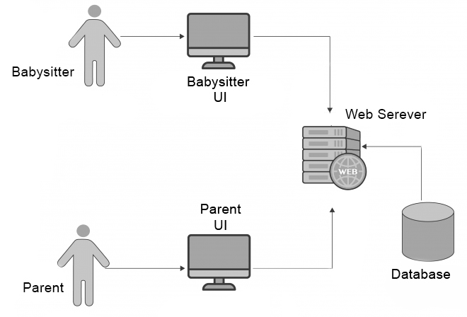

# Babysitter Assistant

## Системна документация

### Цел на приложението
Да се проектира и изгради уеб базирана среда, която да позволява обмен на информация между родители и човек отглеждащ децата им - детегледач(ка).

### Архитектура

Всеки потребите, било то в ролята на 'родител' или 'детегледач' има достъп до съответен потребителски интерфейс посредством уеб сървър и база от данни.

### Поставени и решени задачи.
- Изграждане на модел на база данни
- Изграждане на дизайн на платформата
- Изграждане на модел на потребителски интерфейс
- Избор на библиотеки и технологии при изграждането на проекта
- Изграждане на приложението
    - Създаване на форма за регистриране с възможност за избор на роля
    - Създаване на форма за влизане в профил
    - Имплементиране на потребителки интерфейс за роля 'родител'
        - Начална страница с меню
        - Страница с календар за всяко дете
        - Възможност за обстойно преглеждане на събитие
        - Възможност за добавяне на коментар към събитие
        - Страница за избор на детегледач(ка)
        - Страница с деца ( с възможност за регистриране на ново дете )
        - Страница с възможност за промяна на потребителските данни
    - Имплементиране на потребителки интерфейс за роля 'детегледач(ка)'
        - Начална страница с меню
        - Страница със свързани родители
        - Страница с деца на конкретен родител
        - Страница с деца за които е отговорен(на)
        - Страница с календар за всяко дете
        - Възможност за добавяне на събитие
        - Възможност за обстойно преглеждане на събитие
        - Страница с възможност за промяна на потребителските данни
    - Създаване на начин за изход от профил
    