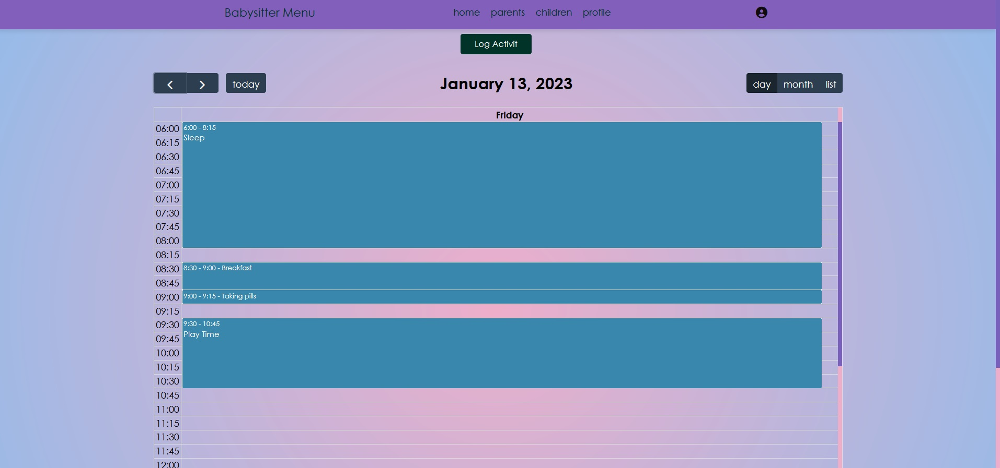

# Babysitter Assistant

## Потребителска документация

### Какво е Babysitter Assistant ?
Babysitter Assistant е уеб базирана среда, която да позволява обмен на информация между родители и човек отглеждащ децата им - детегледач(ка).

### Как Babysitter Assistant може да е от полза?
Целта на системата е да осигури актуална и точна информация на родителите, как протича отглеждането на децата им. Детегледачите ще могат да публикуват актуална информация за децата при всеки удобен и свободен момент, като родителите ще имат възможност да преглеждат данните и да нанасят коментари за всяко въведено събитие.
Системата ще помага както на родителите, да са напълно информирани за всяко действие от страна на детегледачите, така и на самите детегледачи, които ще получават обратна информация от родителите, чрез коментарите.

### Какви възможности предоставя Babysitter Assistant? 

- #### Регистрация
    При регистрация потребителят трябва да въведе следната информация:
    - Три имена
    - Адрес
    - Тел. за контакт
    - Потребителско име
    - Електронна поща
    - Парола

    Потребителят има възможност за избор на роли между:
    - Родител
    - Детегледач(ка)

    

- #### Вход в профил
    При вход в профил потребителят трябва да въведе следната информация:
    - Електронна поща
    - Парола
    

- #### Профил на Родител 

    ##### Панел за бърз достъп (меню)
    Включва връзки към:
    - началната страница
    - страница с календарите на децата му
    - страница за избор на детегледачка
    - страница за децата му
    - страница за редактиране на профила му
    - възможност за изход от профила

    

    ##### Начална страница
    Дава възможност за бърз достъп до календарите на децата ви, връзка с потенциални детегледачи, списък с децата които сте регистрирали и възможност за регистриране на ново дете и промяна на вашите потребителски данни.

    

    ##### Календар
    Тук имате възможност да изберете за кое дете искате да отворите календар на събитията.
    
    При натискане на бутон **Open** се отваря персоналния календар на избраното от вас дете, като тук може да видите информация по интервали на всеки 15 минути за събитията през деня, регистрирани от детегледача. Имате възможност за избор между различни изгледи - дневен, месечен и само самите събития. Също така може да се връщате към отминали дни и да преглеждате събитията от тогава. Текущия ден се отличава с различен цвят.
    
    
    
    При избиране на някое събитие се достъпва страница с обстойна информация за събитието и възможност за добавяне на коментар, за по-добра синхронизация с детегледача 
    

    ##### Детегледачи
    Тук имате възможност да изберете между някой от регистрираните детегледачи, натискайки бутона **Select**
    

    ##### Деца
    В тази страница може да видите вече регистрираните деца, кой е техния детегледач както и бърз достъп до календара. Също така имате възможност да регистрирате ново дете, като натиснете бутона **Add Kid**
    
    При регистриране на ново дете е необходимо да се попълни информация за името и годините му
    
    
    ##### Профил
    Менюто профил ви дава възможност за редактиране на вашите лични данни
    

- #### Профил на Детегледач 

    ##### Панел за бърз достъп (меню)

    Включва връзки към:
    - началната страница
    - страница с родители (клиенти)
    - страница с децата за които се грижи
    - възможност за изход от профила
    
    

    ##### Начална страница
    Дава възможност за бърз достъп до родителите, които са ви клиенти и техните деца и промяна на вашите потребителски данни.

    

    ##### Родители
    Тук може да бъде открит списък с всички родители, които са ви клиенти.
    
    При избор на бутон **See Children** се отваря страница с децата на този родител, за които се грижите.
    
    Тук имате достъп до календара на всяко от децата чрез натискане на бутона **Оpen**. Отваря се персоналния календар на избраното от вас дете, като тук може да въвеждате информация по интервали на всеки 15 минути за събитията през деня. Имате възможност за избор между различни изгледи - дневен, месечен и само самите събития. Също така може да се връщате към отминали дни и да преглеждате събитията от тогава. 
    

    Добавянето на ново събитие е налично само за текущия ден и става чрез избора на бутон **Log Activity**. Необходимо е да се въведе описание на събитието както и информация за време за начало и край на събитието, а след това да се натисне бутона **Add**. 
    

    ##### Деца
    В тази страница имате достъп до всички деца за които се грижите. Отново чрез натискане на бутона **Оpen** може да достъпите персоналния календар на всяко дете.
    

    ##### Профил
    Менюто профил ви дава възможност за редактиране на вашите лични данни.
    
